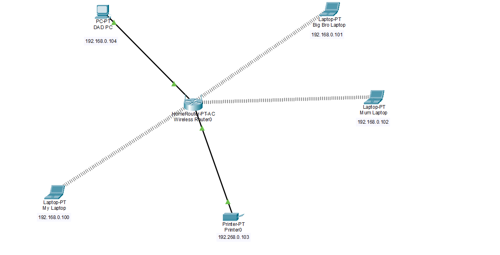
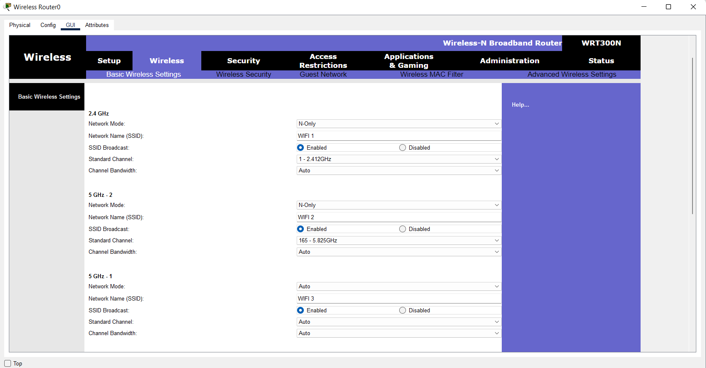
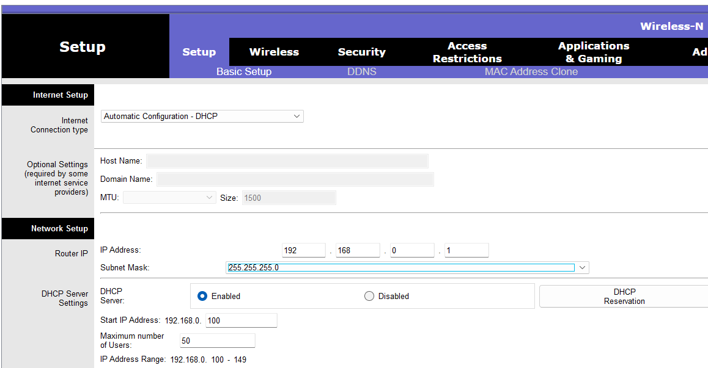
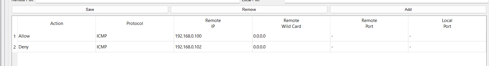
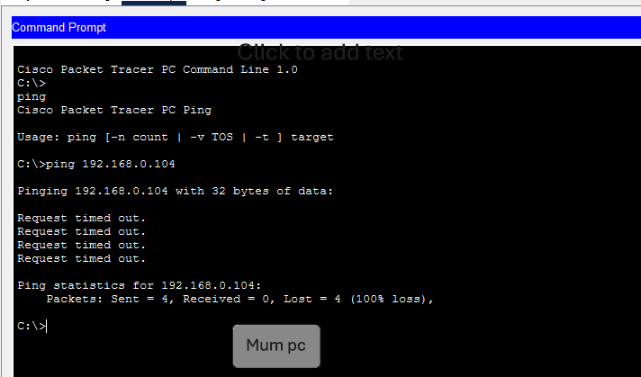
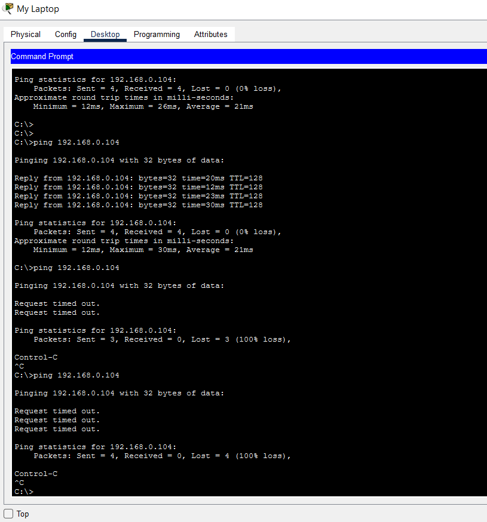

# Home Network Lab (Cisco Packet Tracer)

A simulated home network built in Cisco Packet Tracer, covering topology design, wireless configuration, DHCP, and basic firewall/ACL rules.

## Overview

This project simulates a small home network the kind of setup you'd find connecting a family's laptops and devices through a single wireless router. The goal was to understand how data actually travels between hosts, and to get hands-on with wireless configuration, addressing, and traffic filtering.

## Topology

I chose a **star topology**, based on how my church's network is set up: a central router that every device connects to and exchanges information through. This felt like the natural fit for a home network — one central point of connection, easy to reason about, easy to troubleshoot.

**Devices used:**
- 1 wireless router
- 3 laptops (wireless clients)
- 1 PC and a printer
  

## Wireless Configuration

I configured the router's wireless settings to connect three laptops:

- **Network mode:** N-only — since all connecting devices support the 802.11n standard and I had no legacy devices to support. I left the option open to support legacy devices later if needed.
- **SSID:** Renamed to a custom network name.

## IP Addressing (DHCP)

To confirm connectivity, I checked each device's IP configuration via Desktop → IP Configuration, and enabled **DHCP** on the router so any device joining the network is automatically assigned an IP address — no manual configuration needed per device.

## Firewall Rules (ACLs)

I set up basic firewall rules to control ping traffic between hosts:

- Blocked ping traffic to/from my Dad's PC
- Blocked my Mom's laptop
- Allowed my own laptop to send ping requests

## What I Learned: Default-Deny Behavior

The most useful part of this project was debugging unexpected firewall behavior. After adding a rule to block ping to a specific IP, **all** ping traffic was blocked — including ping from the PC itself — not just the IP I had specified.

Adding an explicit **allow** rule for another PC fixed it, which raised the question: why did specifying a block rule end up blocking everything else too?

The answer: the firewall's **default behavior is deny-all**. Unless traffic is explicitly allowed, it's blocked by default. My block rule wasn't the only thing filtering traffic, the underlying default policy was denying everything not explicitly permitted.

**Why this matters:** default-deny is generally the *safer* posture for security nothing gets through unless you say so but it also means that adding an "allow" rule without understanding the full rule set can accidentally open up more access than intended. If an allow-all rule were added carelessly, it could expose every device on the network. This is a core concept in real-world firewall/ACL design, not just a Packet Tracer quirk.

## Tools Used

- Cisco Packet Tracer

## Notes

This is an early project as I build toward a career in cybersecurity, specifically ethical hacking and penetration testing. Feedback is welcome.
